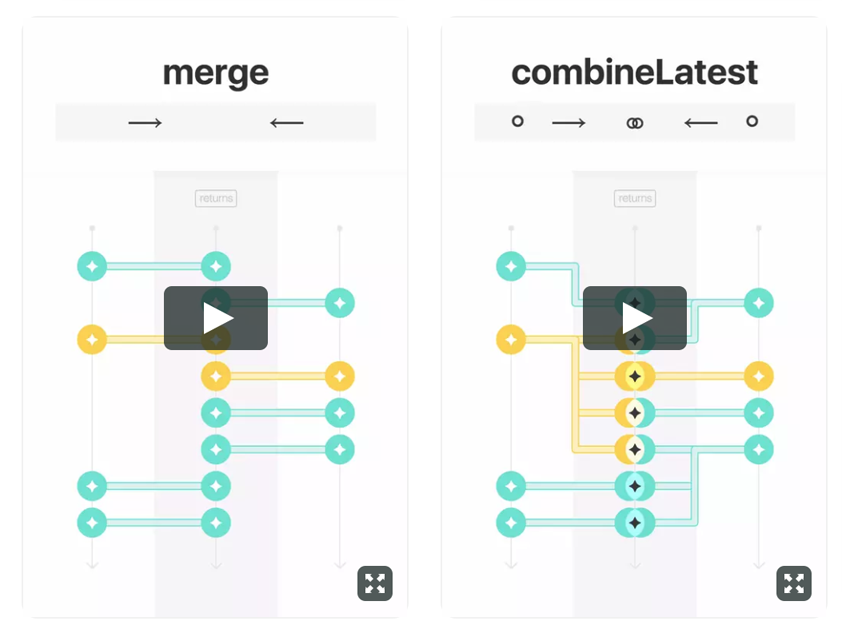
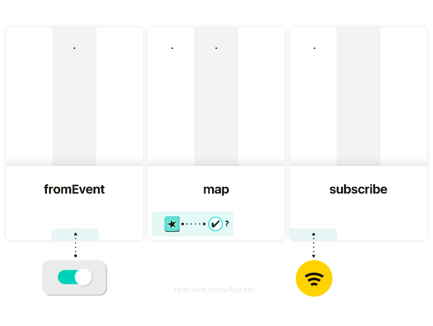

# Change log

[reactive.how](http://reactive.how), learn reactive programming.

## `18.0` Dec 4, 2017

### 🃏
- Add [Episode 12 - One rate-limiting strategy (debounceTime)](/debounceTime)

## `17.0` Nov 27, 2017

### 🃏
- Add [Episode 11 - Initial value!](/startWith)

## `16.0` Nov 20, 2017

### 🃏
- Add [Episode 10 - Last value?](/last)

## `15.0` Nov 13, 2017

### 🃏
- Add [Episode 9 - Take 3 and complete](/take)

## `14.0` Nov 6, 2017

### 🃏
- Add [Episode 8 - zip vs combineLatest](/zip)

## `13.0` Oct 30, 2017

### 🃏
- Add [Episode 7 - combineLatest vs merge](/combineLatest)

## `12.1` Oct 24, 2017

### 🌒
- Update navigation bar for episodes

## `12.0` Oct 23, 2017

### 🃏
- Add [filter](/filter) card
- Add [map](/filter) card variant
- Add [Episode 6 - Filtering with a predicate](/filter)

### 🌕
- Add list of full-sized episodes on homepage

## `11.0` Oct 16, 2017

### 🃏
- Add [Episode 5 - Combination](/merge)

## `10.0` Oct 13, 2017

### 🃏
- Update existing [card deck](http://reactive.how)
- Add "returns" label on cards to see where are input and output streams
- Add timelines with arrows to show how the stream flow on static version of the cards
- Lighten the look and animation of paths between in/out events, to highlight the streams
- Update card arguments with more explicit texts
- Move card title to the top, so the arguments are close to the beginning of the timelines

## `9.0` Oct 9, 2017

### 🃏
- Add [delay](/delay) card
- Add [Episode 4 - Time projection](/delay)

## `8.0` Oct 2, 2017

### 🃏
- Improve the way the time flows on cards (one could have thought events were already under the wrapper)
- Enhance event animation (one may not have noticed the animation on small screen)
- Change the piece placeholders on cards (one may think the card title was the piece name)

### 🃏
- Add [subscribe](/listen) card
- Add [Episode 3 - Reactivity](/listen)

## `7.0` Sept 25, 2017

### 🃏
- Add [map](/map) card
- Add [Episode 2 - Immutability](/map)

## `6.1` Sept 20, 2017

### 🌒
- Add footer links to send me a message
- Tweak button style and layout 

## `6.0` Sept 18, 2017

### 🃏
- Add [fromEvent](/fromEvent) card
- Add [Episode 1 - Streams](/fromEvent)

## `5.0` Sept 5, 2017

### 🌕
- Add card video player
- Add option to play a card full screen on web and mobile

### 🃏
- Improve design of the vertical progress bars
- Adjust color theme and combination borders
- Improve animation speed and timing functions
- Highlight new events with a sparkle animation

### 🌕
- Announce starting date of the [series](http://reactive.how)
- Update combine icon and favicon

## ` ` --------------------- 🌞 Summer break ⛰️ ---------------------

## `4.2` Jul 29, 2017

### 🌕
- Add card shadow

### 🌒
- Tweak design and layout
- Refactor card collection templates

### ☄️
- Fix visual glitches on mobile

## `4.1` Jul 26, 2017

### 🌕
- Add [reactive.how/CHANGELOG](http://reactive.how/CHANGELOG) page (automatically generated from [CHANGELOG.md](https://github.com/cedricss/reactive.how/blob/master/CHANGELOG.md))

## `4.0` Jul 25, 2017

### 🌒
- Improve layout for large screens and mobile devices
- Improve overall look and feel

### 🌕
- Add a new author template
- Add horizontal card scrolling for mobile (with momentum)

### 🃏
- Update card collection name and labels

## `3.1` Jul 22, 2017

### 🌒
- Display more reducing vertical margins

## `3.0` Jul 21, 2017

### 🌕
- Add profile picture
- Add new layout for mobile devices

## `2.2` Jul 20, 2017

### ☄️
- Fix lack of subscription validation message in some cases

## `2.1` Jul 19, 2017

### 🃏
- Add site gif preview

### 🕹️
- Improve subscription form behavior

### ☄️
- Fix links and html markup

## `2.0` Jul 18, 2017

### 🃏
- Release initial card collection site

## `1.1` Jul 13, 2017

### 🐙
- Create initial reactive.how semantic theme, forked from the default one
- Add [semantic ui](http://semantic-ui.com), the UI component framework 

## `1.0` Jul 12, 2017

### 🥁
- Release initial introduction page

### 🏁
- Initial commit
