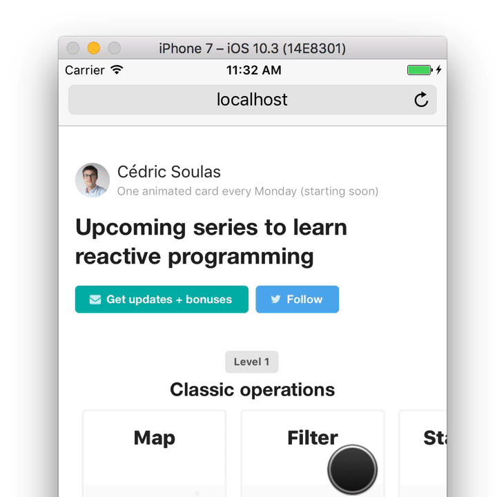
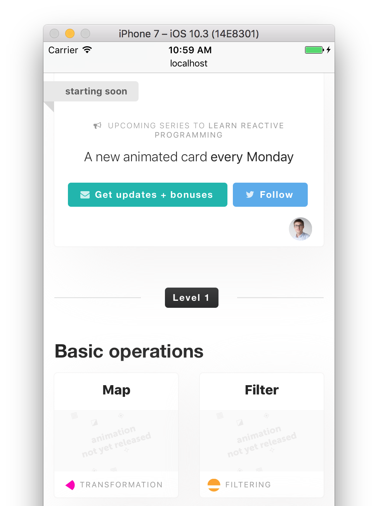
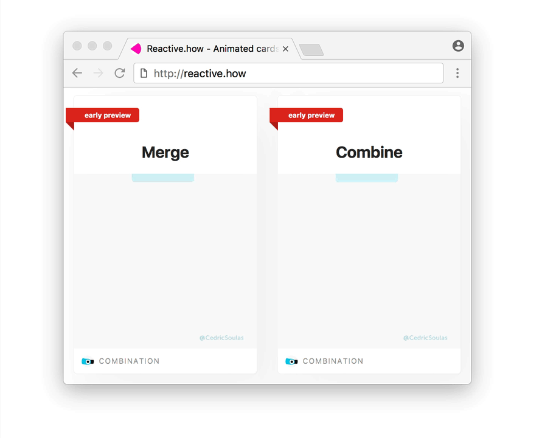
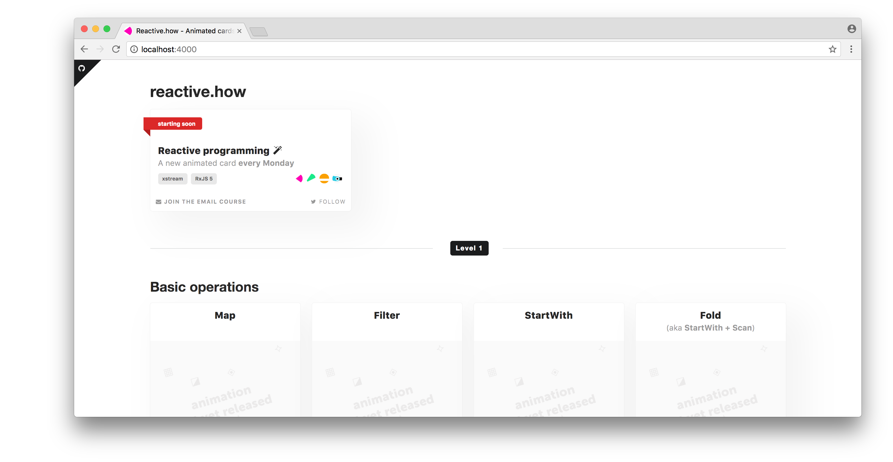
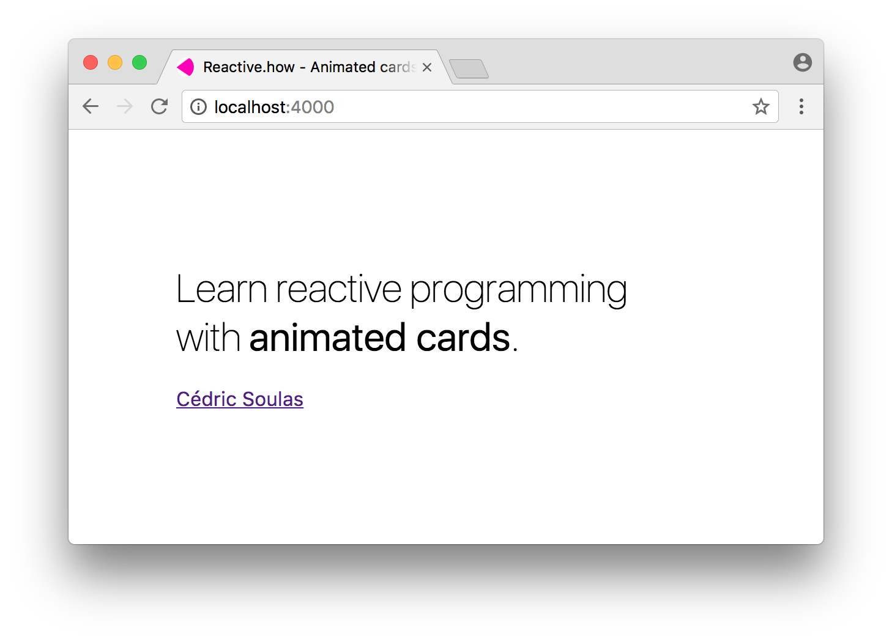

# Change log

## `4.1` Jul 26, 2017

### 🌕
- Add [reactive.how/CHANGELOG](http://reactive.how/CHANGELOG) page (automatically generated from [CHANGELOG.md](https://github.com/cedricss/reactive.how/blob/master/CHANGELOG.md))

## `4.0` Jul 25, 2017

### 🌒
- Improve layout for large screens and mobile devices
- Improve overall look and feel

### 🌕
- Add a new author template
- Add horizontal card scrolling for mobile (with momentum)

### 🃏
- Update card collection name and labels

## `3.1` Jul 22, 2017

### 🌒
- Display more reducing vertical margins

## `3.0` Jul 21, 2017

### 🌕
- Add profile picture
- Add new layout for mobile devices

## `2.2` Jul 20, 2017

### ☄️
- Fix lack of subscription validation message in some cases

## `2.1` Jul 19, 2017

### 🃏
- Add site gif preview

### 🕹️
- Improve subscription form behavior

### ☄️
- Fix links and html markup

## `2.0` Jul 18, 2017

### 🃏
- Release initial card collection site

## `1.1` Jul 13, 2017

### 🐙
- Create initial reactive.how semantic theme, forked from the default one
- Add [semantic ui](http://semantic-ui.com), the UI component framework 

## `1.0` Jul 12, 2017

### 🥁
- Release initial introduction page

### 🏁
- Initial commit
