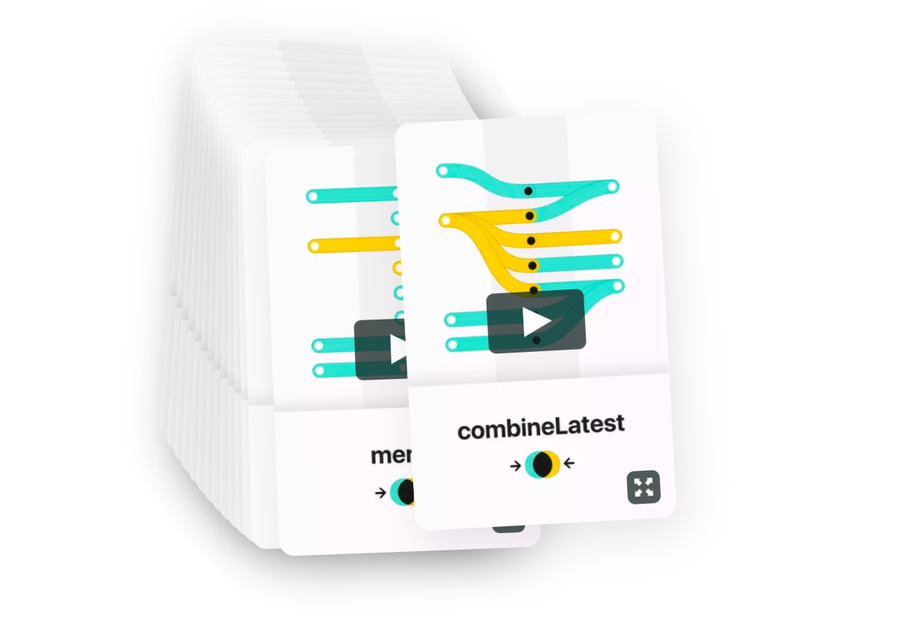

# Reactive.how

## Learn reactive programming

### A new animated card every Monday ✨

- [Watch episodes](http://reactive.how/)
- [Get updates + bonuses](http://reactive.how/#subscribe)

## Contribute

- [Edit the card collection](_data/cards.yml)
- [Send feedback and issues](https://github.com/cedricss/reactive.how/issues)
