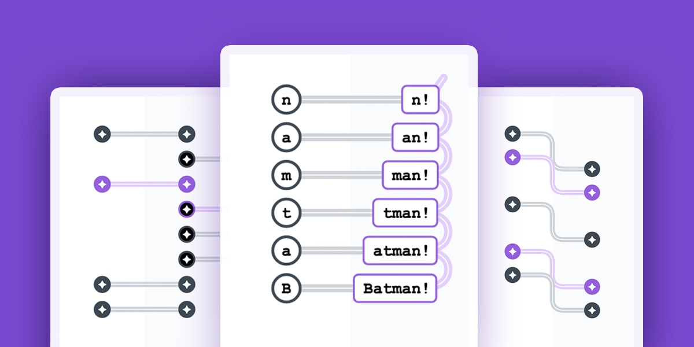

# reactive.how

Experimental branch. Switch to [version 1](https://github.com/cedricss/reactive.how/tree/v1).

- [Learn RxJS operators and Reactive Programming principles](http://reactive.how/)
- [Launchpad for RxJS](https://reactive.how/rxjs)
- [RxJS Explorer](https://reactive.how/rxjs/explorer)
- [Stay tuned](https://reactive.how/#subscribe)
