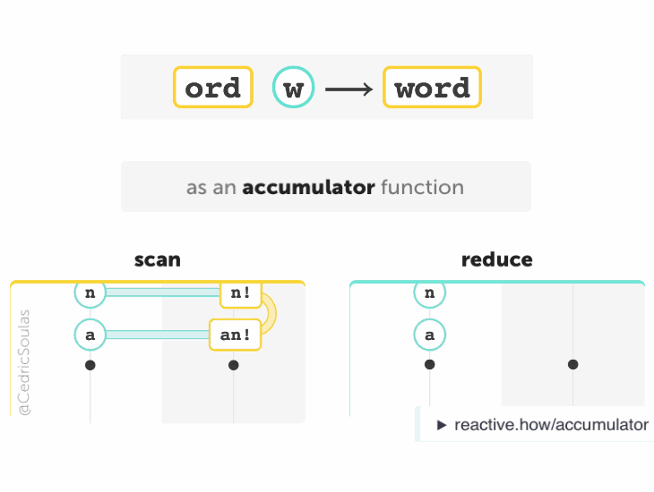
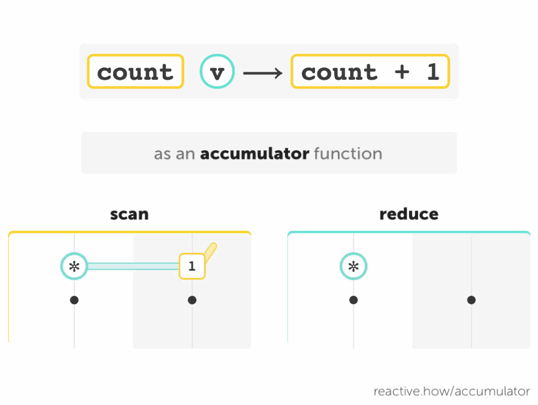

In [Part 1](/predicate), you've learned:

- Some operators may accept functions as arguments. These functions don't have to work with the input or the output stream. The operators do.
- How you label a function (eg. "project" or "predicate" function) depends on how you use it. A function is not a _project_ or _predicate_ function in itself.

## Accumulate values

Today we focus on functions used as _accumulator functions_.

> {:.w450}

A function that:

- takes one <code class="two">value 1</code> and one <code class="one">value 2</code>
- and returns one <code class="two">new value</code>
- where **value 1** and **new value** are of the same type

may be used as an **accumulator** function with the [scan](/scan) and [reduce](/reduce) operators. In this case, <code class="two">value 1</code> and <code class="two">new value</code> are often called "accumulation" or "acc".

Despite the names _accumulator_ and _accumulation_, accumulator functions **don't store** the result "for later use". The operators do save the result. They will eventually give it back to their accumulator function. This is why accumulator functions need to take an accumulation as an argument.

> <code class="two">ord</code> <code class="one">w</code>  ⟶  <code class="two">word</code>
>
> _This function has no memory_

## Ignore the value

Even if a function is used as an _accumulator_ function, it doesn't have to "accumulate" the two input values. It can ignore the second argument:

> {:.w450}

> <code class="two">count</code> <code class="one">value</code>  ⟶  <code class="two">count + 1</code>
>
> _This function only increments the accumulation <code class="two">count</code>_

## Summary

- An _accumulator_ function returns a value of the same type as its first argument.
- It can ignore its second argument or accumulate it with the first one.
- It doesn’t have to remember the result.

## See also

> [{:.w300}](/predicate)   [**project vs predicate**](/predicate)

> [{:.w300}](/reduce)   [**reduce vs scan**](/reduce)