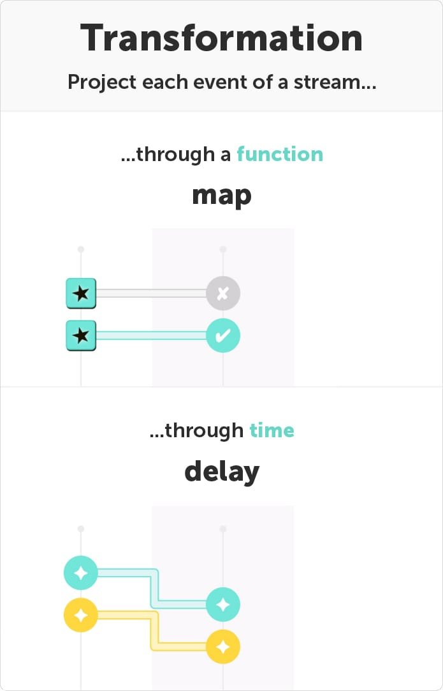
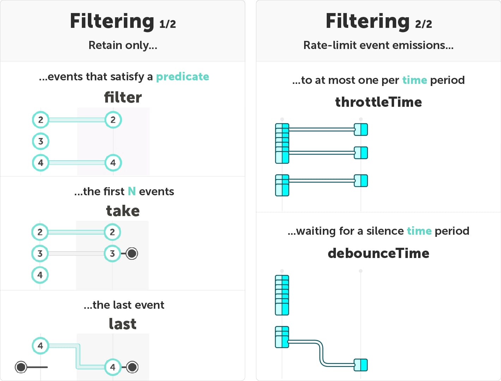
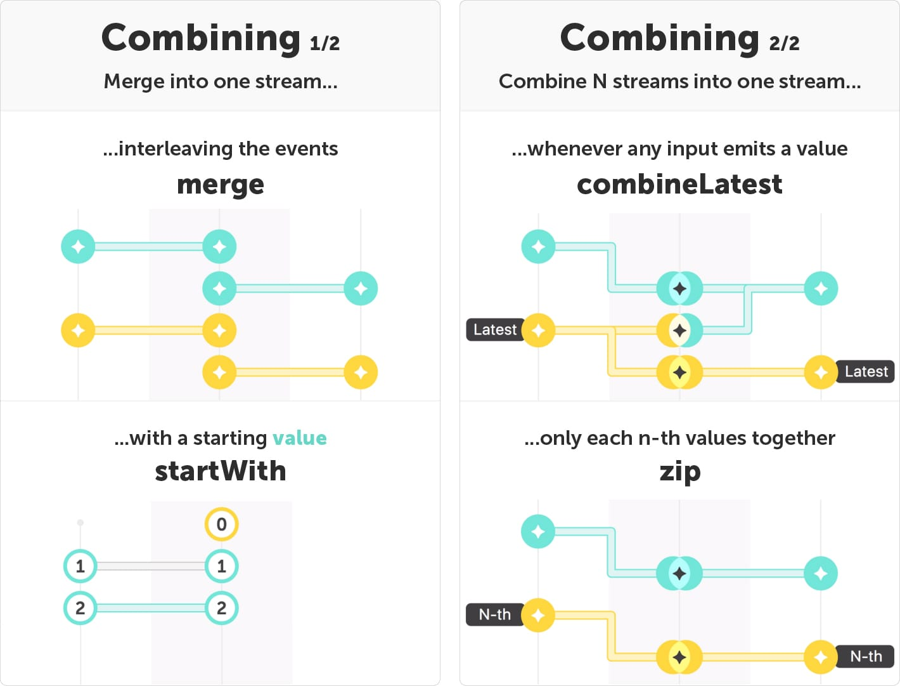

I published the first episode on Monday, 18 September. Today is Monday, 18 December. We are celebrating the 3 month anniversary of the series!

For this 14th special episode, I created **five** special cards: _categories_. They show an overview of the different stream operations you have learned about so far. With those _category cards_, you can quickly find the operator you need!

I started this series with three important Reactive Programming concepts: [streams](/fromEvent), [immutability](/map) and [reactivity](/listen). You should really learn those principles first!

> ## One input stream

> {:.w300}

### Related episodes:

- [map](/map) and [delay](/delay)
- [filter](/filter), [take](/take) and [last](/last)
- [throttleTime](/throttleTime) and [debounceTime](/debounceTime)

> ## Several inputs

### Related episodes:

- [merge](/merge) and [startWith](/startWith)
- [combineLatest](/combineLatest) and [zip](/zip)
