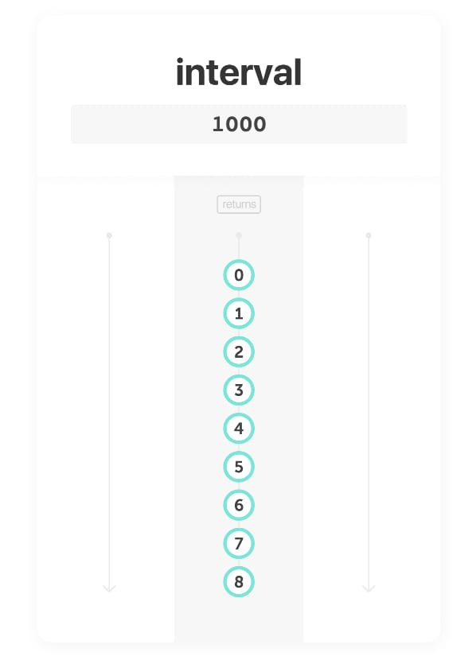
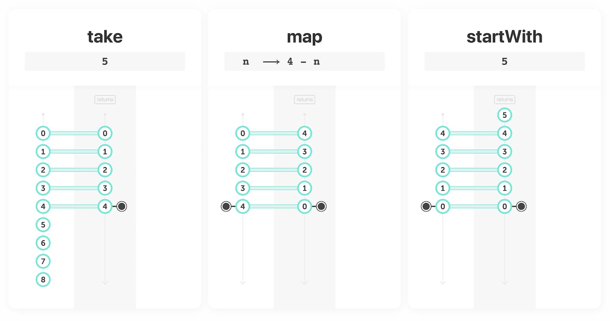
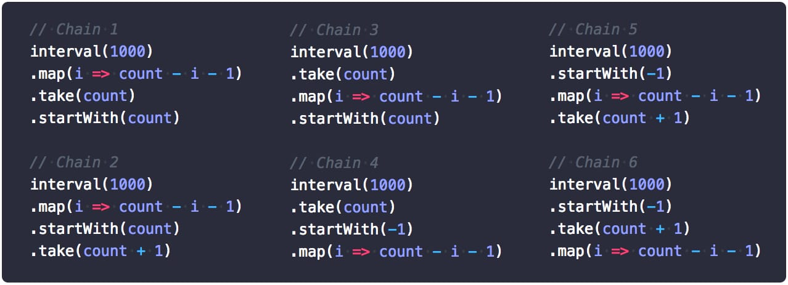

Two weeks ago, I showed you the [interval](/interval) card and challenged you to create a countdown to celebrate the new year.

> [{:.w250}](/interval)
>
> [Read Episode 16 - Interval](/interval)

We begin with `❚ interval` and set period of `1000` milliseconds. It creates a stream that emits incremental numbers, periodically. Remember: this card will emit `0` only `1000` ms after the stream has started.

We would like to create a countdown from 5 to 0 that:

- starts immediately with 5
- completes immediately after 0

## Choosing the cards

### Constraint 1: having a finite number of event values

[`❚ interval`](/interval) never stops emitting event values. But we only need the first ones.
"_We only need X_" guides you to the [filtering category](/categories). Then, "_the first ones_" helps finding the appropriate filtering card: [`❚ take`](/take).

### Constraint 2: reversing the progression of values

Instead of a `0 1 2 3 4 5` stream, we are looking for `5 4 3 2 1 0`. We need to transform each value: `0` into `5`, `1` into `4`, etc.
"_We need to transform **each value**_" guides you to the [transformation category](/categories) and the card [`❚ map`](/map).

### Constraint 3: starting immediately with 5

The first value is emitted only 1000ms after the stream has started. Naturally, the [`❚ startWith`](/startWith) card comes to our mind when we need to "_start immediatelly with a value_".

### Constraint 4: completing immediately after 0

This constraint means the stream should emit the `◉ complete` notification immediately after the end value of the countdown (learn more about "completion" in [Episode 9](/take)). It turns out that
 [`❚ take`](/take) (we picked for contraint 1) does exactly that after having filtered the first N event values.

## Setting the arguments

We now have picked 3 cards: `❚ take`, `❚ map` and `❚ startWith`. As we learned in [Episode 3](/listen), we can put cards one after another, [in a chain](/listen#chain). Each card in this chain operates on the stream generated by the previous card. In which order do you put the cards? There are 6 chains possible:

- 1) interval ⇢ map ⇢ take ⇢ startWith
- 2) interval ⇢ map ⇢ startWith ⇢ take
- 3) interval ⇢ take ⇢ map ⇢ startWith
- 4) interval ⇢ take ⇢ startWith ⇢ map
- 5) interval ⇢ startWith ⇢ map ⇢ take
- 6) interval ⇢ startWith ⇢ take ⇢ map

In the case of this challenge, any of this chain could work! **But** you have to choose the right arguments in each scenario.

Can you write six solutions using only `❚ take`, `❚ map` and `❚ startWith`?

### Solutions

With the chain 3) `interval ⇢ map ⇢ take ⇢ startWith`, you have to set those arguments:

More generally, here are the six chains with the proper arguments (replace `count` with `5` to get a countdown from `5` to `0`):

Obviously, one could argue that some of those solutions are inelegant. Which one do you prefer?

PS. There are even more solutions to this challenge. But we need to see new categories and new cards before. I'll update this article over the course of 2018 as we learn new things!