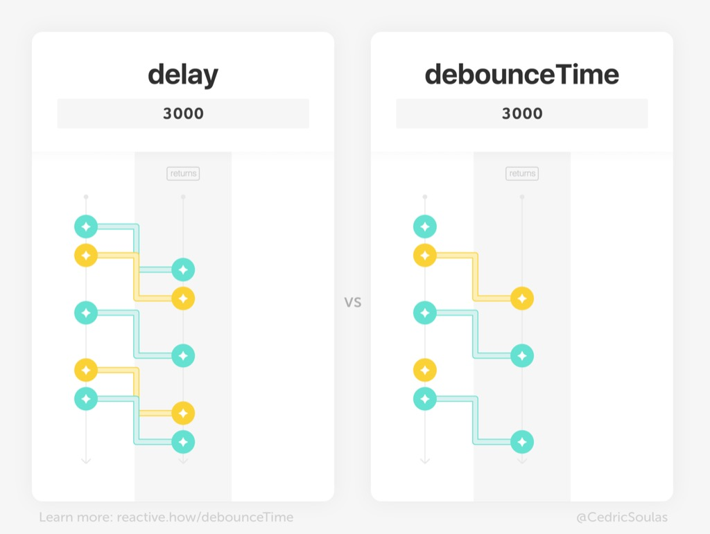

If your stream is created from key presses or mouse movements, you'll likely deal with bursts of events. 
But you can't react to every single event, as it would overload the CPU or flood the servers with too many requests.

A strategy is to wait for a certain "emission silence" window of time (where the user has stopped typing or moving his mouse) to actually handle the latest word or mouse position.

To do so, you can use the `❚ debounceTime` card. Like `❚ delay` (read [Episode 4](/delay)), it waits for a certain time period and delays events. But `❚ debounceTime` can also ignore events:



Use a `▬ number` piece on `❚ debounceTime` to set a "**due time**" silence, such as `3000` milliseconds. Then, this is how `❚ debounceTime` operates:

- Whenever an event is emitted, the period of silence measured restarts from zero
- The card waits for a "**due time**" silence and then emits the latest value of the input stream
- As a result, it returns a new stream of debounced events

## Trying different due times

> {:.w350} 
> The due time is small enough that no events are ignored

> {:.w350} 
> With a 3000ms due time, some events are ignored

> {:.w350} 
> As the due time gets larger, even more events are ignored

## Conclusion

Debounce is a **rate-limiting** operator. It ignores events but also delays others. Next Monday, I'll introduce another strategy to deal with bursts of events, without delaying events.