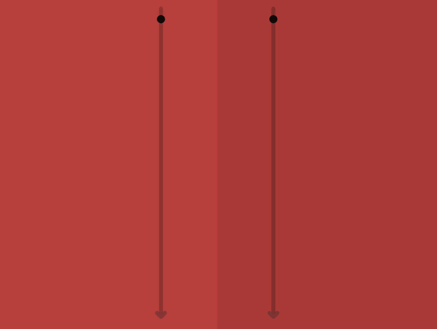

Today's episode is pretty straightforward so that you and I can quickly return to the festivities :)

> {:.w300}
>
> This is `❚ distinctUntilChanged` 
> (aka skipRepeats or dropRepeats). 
> It ignores consecutive duplicates.

> ## I wish you a wonderful Holiday Season!