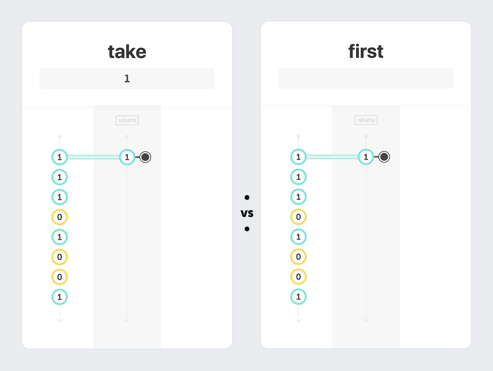
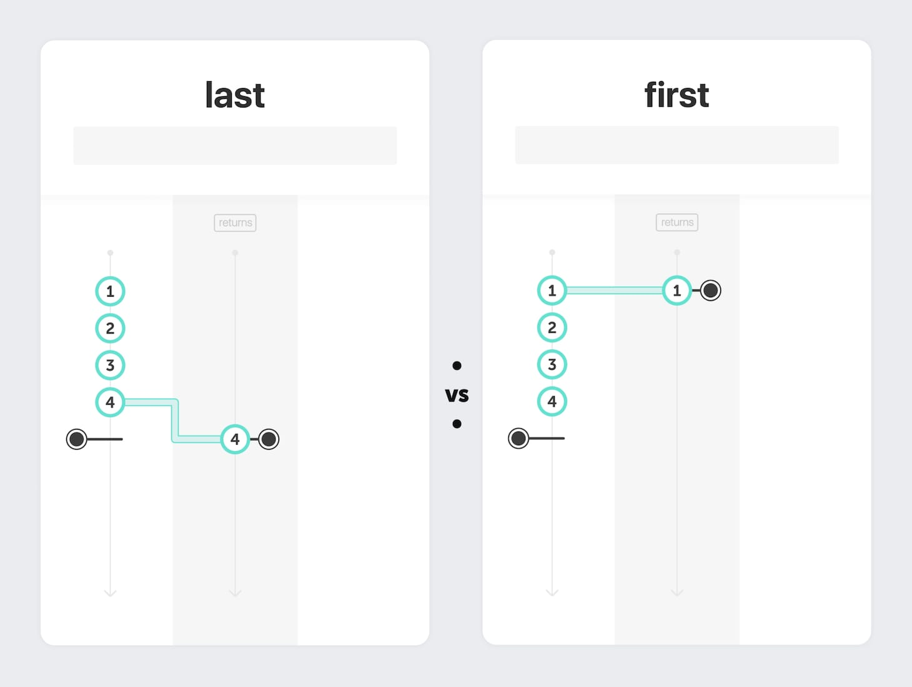
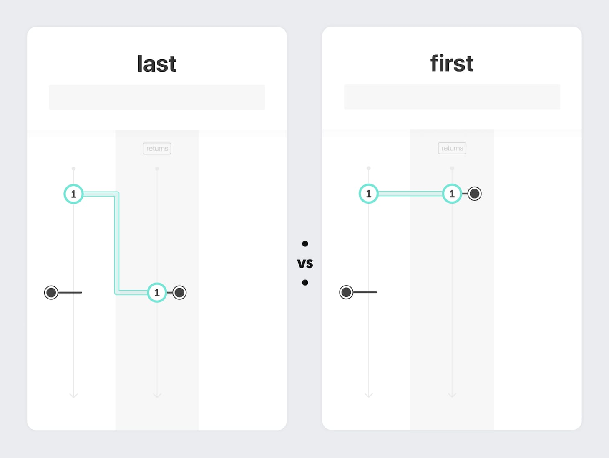

Today's card is `❚ first`. This is how it operates:

- When the input stream emits a first value, the output stream:
    - emits this first value
    - and completes **immediately**

Read more about stream completion in [Episode 9](/take#stream-completion).

## Take vs First

**Question**: Do `❚ take(1)` and `❚ first()` return the same stream of events?

 
 

**Answer**: Clearly, `❚ take(1)` and `❚ first()` return the same stream of events when the input stream emits at least one event. But the results may be different if the input stream emits no value before its completion (I'll detail such edge cases in a future episode).

## Last vs First

`❚ last` (seen in [Episode 10](/take)) is the counterpart of `❚ first`:

**Question**: Are `❚ last` and `❚ first` outputs identical when the input stream emits only one value?

 
 
 

**Answer**: Not when the input stream emits only one value **and completes later** or **never completes**. `❚ first` and `❚ last` are not strictly "symmetrical". Remember that `❚ last` has to wait for the `◉ complete` notification ([read more about stream completion](/take#stream-completion)).

## Quick Exercises

Given a stream of numbers, return a stream that emits only the first **even** number and completes immediately. For example, given the stream `1 1 1 0 1 0 0 1`, emit only the first `0`.

And what about emitting the **last** even number?
