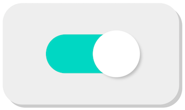

This is your first Monday! I am so excited to have you on board. We build reactive machines here. Our building blocks are **cards** and **pieces**.

Every Monday we'll play with cards and pieces to learn new reactive programming skills. Today, I'm pleased to give you your first building blocks:

> {:.w100}
>
> <small>The `▬ toggle` interactive piece. It can be turned on and off.</small>



> <small>The `❚ fromEvent` card</small>

This card accepts a source of events, such as _click events_ on the `▬ toggle` interactive piece. As a result, it creates **a sequence of events over time**. This sequence is called a **stream**.

Reactive programming is programming with **streams**. With the full deck of cards, you'll be able to:

- **create** a stream from various sources
- **transform** and **filter** a stream in different ways
- **combine** multiple streams
- and more!

I can’t wait to give you new cards!

## Summary

Congrats on your first experiment! 

* you unlocked `▬ toggle`
* you unlocked `❚ fromEvent`
* you learned the concept of **stream**

{:.box}
🤔

This event box is still a mystery though. What's inside? How can we open each box of the stream? That will be for next Monday!