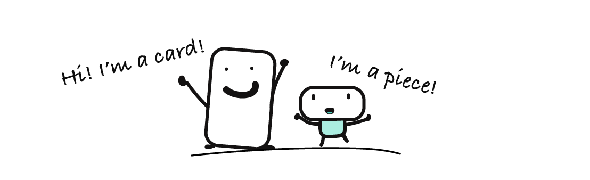
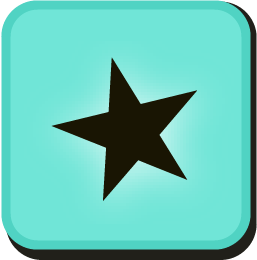



<a class="ui basic tiny button" href="/map">
     Lesson 2 - Immutability <i class="arrow right icon"></i>
</a>

## Lesson 1 - Streams

Welcome to _The Reactive Company_!

This is your first Monday! I am so excited to have you on board. We build silly reactive machines here. Our building blocks are **cards** and **pieces**.

Every Monday we'll play with cards and pieces to learn new reactive programming skills. Today, I'm pleased to give you your first building blocks:

* the `▮ fromEvent` card 👍
* the `▬ toggle` piece 👍

The `▬ toggle` is an interactive piece. Go ahead, turn it on and off. Nothing happened? Put the toggle on the `▮ fromEvent` card and try again.



It creates **a sequence of events over time**. This sequence is called a **stream**.

**Reactive programming** is programming with **streams**. With the full deck of cards, you'll be able to:

- **create** a stream from various sources
- **transform** and **filter** a stream in different ways
- **combine** multiple streams
- and more!

I can’t wait to give you new cards!

## Summary

Congrats on your first experiment! 

* you unlocked `▬ toggle`
* you unlocked `▮ fromEvent`
* you learned the concept of **stream**

{:.box}
🤔

This event box is still a mystery though. What's inside? How can we open each box of the stream? That will be for next Monday!

<a class="ui basic tiny button" href="/map">
     Lesson 2 - Immutability <i class="arrow right icon"></i>
</a>

