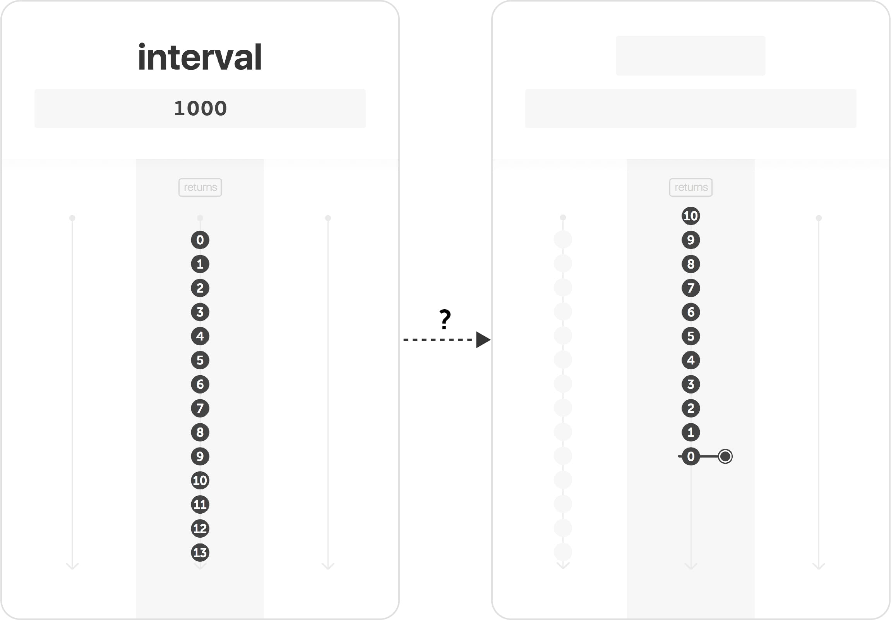

In the [first episode](/fromEvent) we created a stream from user clicks. Let's see a new way of creating streams.

A clock is another source of events. Tick, tock. With `❚ interval` you can create a stream that emits incremental numbers, periodically. For example, with a period of `1000` milliseconds, it will work like this:

- 1000ms after the stream has started, it emits 0
- Then, after 1000ms, it emits 1
- And so on

{:.w300}

_Note: this is how it works in RxJS. It may be a bit different with some other reactive libraries. I will compare them in a future episode._

In the Creating Stream category, you now have two cards:

- fromEvent (read [Episode 1](/fromEvent))
- interval

Learn more about the three other categories I wrote about on [reactive.how/categories](/categories) (transformation, filtering and combining)

## New-Year exercise 🎉

Now, are you ready for a little challenge? 

- Create a countdown from 10 to 0
    - The stream starts immediately with 10
    - The stream completes immediately after 0

Begin with `Rx.Observable.interval(1000)` (or the equivalent in the reactive library you use) and complete with some operators we have seen in the previous episodes. You can see an overview of the different stream operations we have learned about so far on [reactive.how/categories](http://reactive.how/categories).

I've set up a ready-to-use [**sandbox**](http://jsbin.com/cuqezim/edit?js,output) so you can easily write and test your solution. You can reply to this email if you need help or want a review of your solution 😉.

[Write and test your solution in the sandbox »](http://jsbin.com/cuqezim/edit?js,output)

