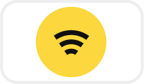

So far you learned 2 essential Reactive Programming principles: **streams** and **immutability**. Today we explore a third principle: **reactivity**. You'll need:

* a new `❚ subscribe` card 
* a new `▬ setWifi` _listener_ piece

> {:.w100}
>
> <small>The `▬ setWifi` _listener_ piece. It turns the wifi _on_ or _off_.</small>

You also need all the cards and pieces you previously received. Let's put them all together like this:



Yes! You can put cards one after another, **in a chain**. Each card in this chain operates on the stream generated by the previous card:

- `❚ fromEvent` reacts to the `▬ toggle`. It creates a sequence of toggle events over time, **in reaction** to each toggle status change (read [Episode 1](/fromEvent)).
- `❚ map` projects each toggle events to `✘ on` or `✘ off` (read [Episode 2](/map)).
- `❚ subscribe` adds `▬ setWifi` as a **listener** of the stream. This listener accepts `✘ on` or `✘ off` event value and turns the wifi _on_ or _off_ accordingly.

## Summary

In Reactive Programming we **react** to piece and stream updates. This is the reactivity principle. And today, by assembling several cards together, you built your first reactive machine!

* you unlocked `❚ subscribe`
* you unlocked `▬ setWifi`
* you created a **chain** of cards
* you **subscribed** to a stream, adding a **listener**
* you learned the principle of **reactivity**

You now have the basic knowledge of Reactive Programming. Over the next lessons, you'll receive new cards that transform streams. We'll build more advanced reactive machines!