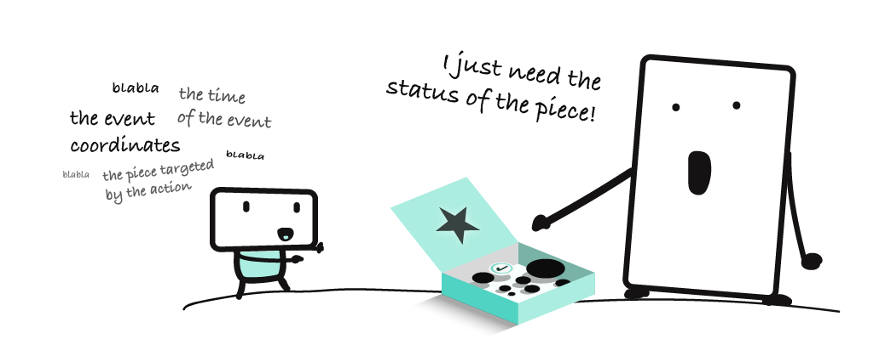
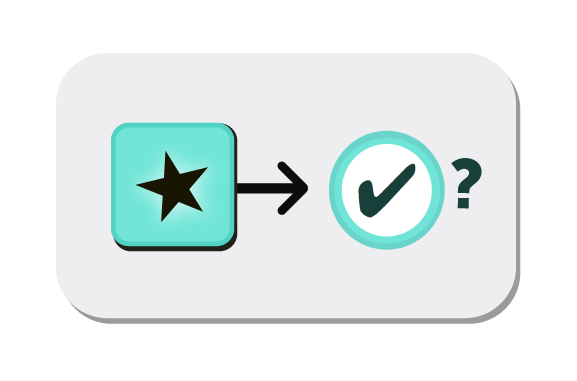

<a class="ui basic tiny button" href="/fromEvent">
    <i class="arrow left icon"></i> Episode 1 - A stream of toggle events
</a>
<a class="ui basic tiny button" href="/listen">
    Episode 3 - Reactivity <i class="arrow right icon"></i>
</a>

## Episode 2 - Immutability

Last Monday you created [a stream of toggle events](fromEvent). When an action was performed on the toggle (on→off or off→on), an event box was emitted.

{:.box}
{:.box}
{:.box}

You can find dozens of properties inside each box. In particular, a box contains a property about the **status** of the toggle after the action. This is what we are looking for!

Today I'm happy to hand you:

* the `▮ map` _transformation_ card 
* the `▬ isChecked?` _projection function_ piece

> {:.w100}
>
> <small>The `▬ isChecked?` piece. It works on events from "checkable" interactive pieces: checkboxes, radio buttons, options of a menu, toggles, etc.</small>

Here is how they work together:



The `▮ map` card waits for events from an input stream (eg. _toggle events_). It projects each event of this input stream with a _projection function_ (eg. `▬ isChecked?`). 

A card never modifies the input stream. Instead, it returns a **new** stream. This principle is called **immutability**.

## Summary

Awesome!

* you unlocked `▮ map`. 
* you unlocked `▬ isChecked?`
* you created a new stream from an existing one
* you learned the principle of **immutability**

In your collection, you now have:

* one **creation** card `▮ fromEvent`
* one **transformation** card `▮ map`
* one **interactive** piece `▬ toggle`
* one **projection function** piece `▬ isChecked?`

Next Monday we'll start building a little machine by assembling several cards together. See you!

<a class="ui basic tiny button" href="/fromEvent">
    <i class="arrow left icon"></i> Episode 1 - A stream of toggle events
</a>
<a class="ui basic tiny button" href="/listen">
    Episode 3 - Reactivity <i class="arrow right icon"></i>
</a>