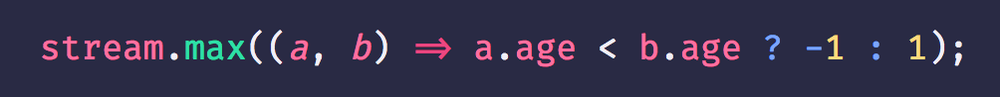

This is how a `❚ max` operator would operate with an input stream:

* **When the input stream completes**, the output stream:
  * emits the largest value emitted on the input stream
  * and immediately completes

Some reactive stream libraries (eg. RxJS) provide this `❚ max` operator, while others don't. How would you code _max_ yourself?

### Comparer function

In RxJS, `❚ min` and `❚ max` accept on optional comparer function as an argument.

For example:

> {:.w400}

> ## See also

> [{:.w300}](/rxjs/pipeable-operators)   [**Pipeable operators - Build your own with RxJS!**](/rxjs/pipeable-operators)
